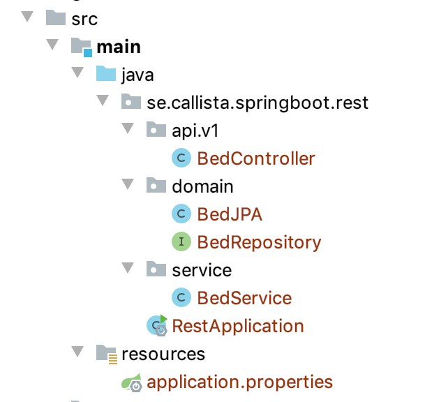

# springboot-rest-sample

This sample will be enhanced in a number of steps each tagged in GIT which are the headline below

## Start ##

The tag start will have the initial set-up of the project with one entity and here we want to highlight some parts.

### Initial project structure for Java files ###

#### Controller classes ####

Here we receive incoming REST calls. The only logic that should be performed here is preparing data to call a service that will do the work and to create the response.
As you can see we are right now exposing the domain classes to the outside, this will be changed in the coming updates.

#### Service classes ####

Here we call the corresponding repository classes to do the intended work. We will add some more error handling later...

#### Domain classes ####

Here we use Lombok to minimize the code to write.

Initially we have only one domain class, this we will soon change ...

Note the annotation @Enumerated(EnumType.String) in the Bed class.
This will make sure that we write the String values to the database and not the ordinal numbers for our enum.

We will also have repository classes in this directory.

### Test application
1. Build the application

1. Start the application from Gradle task application -> bootRun

#### Curl access
1. Use curl to get data from the application

    curl -X GET "http://localhost:8080/api/v1/bed" | jq

1. As you can see we don't have any data yet! Insert data

    curl -d '{"name":"kalle","state":"FREE"}' -H 'Content-Type: application/json' http://localhost:8080/api/v1/bed

1. Now try to get data!

#### Database access

1.Open the url http://localhost:8080/h2-console

1. Use the JDBC URL found in output when the application starts.

1. Select BED and get all records.

1. Simplify the JDBC URL by adding a H2 property in the application properties! (Uncomment)

## Step 2 ##

### Added structure ###
we have added a structure for our entities as follows:

Hospital --> Care Unit --> Bed

Please note the dependency between Hospital, Care Unit and Bed expressed by @OneToMany and @ManyToOne annotations.
To be sure to not get circular dependencies we have also Json annotations as @JsonManagedReference and @JsonBackReference

### Added OAS ###
By adding a dependency to Open Api (https://www.openapis.org/) we can now more easily interact with our APIs.
We have set a property to make the call to make the UI look like swagger.

1. Try accessing the URL at: http://localhost:8080/swagger-ui.html

### Simple Tests ###
We have also added some simple tests for the Hospital controller and service.

1. Test to run the testsuites in the project

## Step 3 ##

### Introduce DTOs ###
We don't want to expose database entities in the API-layer. This we solve by introducing DTOs.

Here we will use a mapper tool called MapStruct that maps between entities and DTOs.

## Step 4 ##
Using Spring profiles and loading example data

### Spring profiles ###
We now convert our application.properties to application.yaml. This to make it easier to use Spring profiles.

1. Look att application.yaml!

### Example data ###
When using an application it is often very useful to load some example data, especially if the data should be shown in a GUI!

The loading of the example data is tied to the Spring profile example, look at the beginning of the file.

